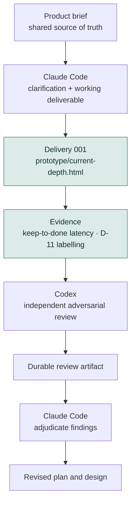

# Current Depth
*Working title.*

Current Depth is an early-stage personal project about two related problems:

1. building a better way to stay current with professional reading without recreating an inbox or backlog; and
2. learning how to work more deliberately with coding-agent harnesses such as Claude Code, Codex, and later Cursor.

The **product brief**, not this README, is the source of truth for product decisions.

---

## Why this repo also exists as an agent-workflow lab

I want to move beyond choosing whichever model is newest and instead build evidence about two different questions:

### Question A — Model

> Which model reasons best about a given kind of task?

### Question B — Harness

> Which working environment helps me accomplish that task best?

Those are not the same question.

A comparison such as Claude Code + one model versus Codex + another model is useful as an **operational benchmark** — it can tell me which setup I prefer for the work — but it does not isolate model quality.

The longer-term aim is to learn when to use particular models, harnesses, skills, review patterns, and orchestration strategies based on evidence rather than novelty.

---

## Current stage

**Pre-architecture, but no longer nothing-built.**

Delivery 001 is live: five items picked from real subscriptions, a seven-slot shelf, and a keep-to-done clock. It lives at [`prototype/current-depth.html`](prototype/current-depth.html) — open it as a file and it saves to that browser; published as an Artifact it syncs across devices.

As of brief v1.9, twenty-one of twenty-two decisions are `Confirmed` and seven of the original unresolved questions are closed. What remains is evidence, a handful of cheap questions, and the D-11 evaluation. Section 10 of the brief carries the current order of work.

**What is settled that changes the shape of the thing:**

- Lane A is capped at five items per delivery — a number derived from the success criterion, not chosen by taste (`D-18`).
- Success is a latency measure, median keep-to-done of 14 days or less, not a count of things read (`D-15`).
- Metrics may only come from gestures Barbara would make anyway. No gesture exists in order to feed a measurement (`D-16`).
- Delivery arrives as a recurring calendar event she creates by hand, because every mailbox she owns runs between 66% and 91% unread (`D-20`).
- Any ranking must beat reverse-chronological on a hand-labelled set or be deleted — and deleting it counts as a good outcome (`D-11`).
- Lane A carries pointers; full article text is pulled only when an item is kept, so depth arrives where the commitment is (`D-22`).

**Still architecture, still not authorised:** storage, hosting, ranker implementation, ingestion.

Some items in the product brief are:

- **Confirmed**
- **Proposed**
- **Assumptions**
- **Unresolved**

Those categories matter. Nothing in this README should upgrade a proposed decision or assumption into a requirement.

See [`docs/product-brief.md`](docs/product-brief.md) for the current product state.

---

## Initial cross-harness experiment

The first workflow under test is intentionally simple:



**Where this stands:** one full loop is closed. C is done, D is running, and E through G have each happened once — Codex reviewed brief v1.8 from a named commit, the review landed in `docs/reviews/`, and the adjudication sits beside it. H is the next work.

The accounting that matters for the experiment: **both model and harness changed at once**, so this first cycle is an operational benchmark and says nothing about model quality by itself.

The revision to this workflow worth noting: the original sequence put implementation last, after the brief was "ready". That was wrong for this project — the brief's own sharpest risk is that building replaces reading, and the cheapest defence against it was to ship something usable early and let the evidence accrue from ordinary use. Clarification and the deliverable now run together.

Codex reviews from a **named commit on the remote**, not from a pasted copy — a pasted copy cannot be verified as identical afterwards, which would undo the independence the experiment depends on.

Cursor will be introduced later as a third challenger, after the first Claude Code ↔ Codex workflow is interpretable.

The point is not to maximize the number of agents. The point is to give different reasoning jobs **independent contexts** and leave an inspectable record of what happened.

---

## Ground-truth hierarchy

For project work, use this order:

1. `docs/product-brief.md` — product status, decisions, assumptions, unresolved questions
2. accepted artifacts in `docs/plans/`, `docs/reviews/`, and `docs/evals/`
3. `AGENTS.md` — shared agent operating rules
4. `CLAUDE.md` — Claude-specific adapter instructions
5. conversation history — useful context, but not authoritative project state

If two artifacts conflict, surface the conflict rather than silently reconciling it.

---

## Repository map

This is a **target / evolving structure**, not a claim that every path currently exists.

```text
current-depth/
├── README.md
├── AGENTS.md
├── CLAUDE.md
│
├── prototype/
│   └── current-depth.html    # Delivery 001 — the working deliverable
│
└── docs/
    ├── product-brief.md
    ├── plans/          # 2026-09-06-product-clarification-plan.md
    ├── reviews/        # v1-8-codex-review.md + its adjudication
    └── evals/          # README.md, held-out-2026-08-24.md — the D-11 labelling set
```

`prototype/` holds a hand-made deliverable, not an architecture. Nothing there implies a storage design, a pipeline, or a vendor.

Implementation directories should be added only when an accepted architecture justifies them.

> **Git note:** Git does not track empty directories. A directory may exist locally while being absent from `git status`, `git ls-files`, a remote push, or file-oriented search tools. Agents must verify filesystem state directly before claiming that a directory does or does not exist.

---

## Working principles

- **Keep product truth out of harness instructions.** `AGENTS.md` and `CLAUDE.md` should remain light.
- **Persist important reasoning.** Plans, reviews, decisions, and evals should survive a fresh agent session.
- **Do not harden assumptions accidentally.** Preserve the product brief's status labels.
- **Prefer independent review.** A reviewer should receive the artifact, not the implementer's full reasoning history.
- **Make evaluation explicit.** Correctness, interventions, time, cost, regressions, and human preference can all matter.
- **Prefer evidence over sophistication.** More agents, tools, abstractions, or newer models are not automatically better.

---

## What belongs here — and what does not

The README explains:

- why the project exists
- how the cross-harness experiment works
- where project truth lives
- the broad repository structure

It intentionally does **not** restate detailed product requirements.

That separation is deliberate: if a product decision changes, it should be changed once in the product brief rather than copied into multiple agent-facing files.

---

## Working title

**Current Depth** is provisional. Naming is not a blocker for the current work.
