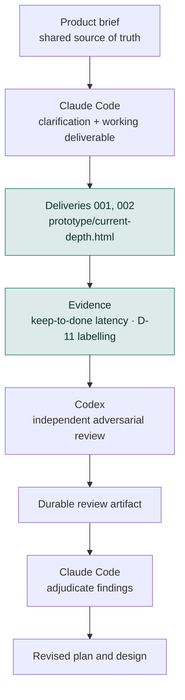

# Current Depth
*Working title.*

Current Depth is an early-stage personal project about two related problems:

1. building a better way to stay current with professional reading without recreating an inbox or backlog; and
2. learning how to work more deliberately with coding-agent harnesses such as Claude Code, Codex, and later Cursor.

The **product brief**, not this README, is the source of truth for product decisions.

---

## Why this repo also exists as an agent-workflow lab

I want to move beyond choosing whichever model is newest and instead build evidence about two different questions:

### Question A — Model

> Which model reasons best about a given kind of task?

### Question B — Harness

> Which working environment helps me accomplish that task best?

Those are not the same question.

A comparison such as Claude Code + one model versus Codex + another model is useful as an **operational benchmark** — it can tell me which setup I prefer for the work — but it does not isolate model quality.

The longer-term aim is to learn when to use particular models, harnesses, skills, review patterns, and orchestration strategies based on evidence rather than novelty.

---

## Current stage

**In use, and now building.**

### The live page

> **https://claude.ai/code/artifact/961d6ea5-b875-4c9c-96f5-59a32a2577c9**

That is the product. It is where the reading actually happens, and it is the link carried by the recurring calendar event that makes the delivery *arrive* rather than wait to be remembered (`D-20`). **The URL is stable and never changes** — new deliveries are published to this same address, which is the property that lets the calendar event be created once, by hand, and never touched again.

Private to Barbara's account: opening it requires being signed in as her, so the link is safe to record here.

Source for the page lives at [`prototype/current-depth.html`](prototype/current-depth.html); publishing that file to the URL above is how a delivery ships.

---

Two deliveries are live and in real use. Delivery 002 is the first to carry canonical article links with the text embedded on the shelf.

**On where state lives.** Opened as a local file, the page saves to that browser only. Published at the URL above it writes to a server-side store — confirmed 7 Sep 2026 by reading the store directly and finding the kept item in it, and **confirmed on a second device the same day by Barbara**. So the shelf does follow her between machines.

That took three attempts to establish, and the history is worth keeping: the claim was asserted before it was ever tested, then contradicted when seven kept items turned out never to have reached the store, then confirmed. The page now states which mode it is in at the foot of every view — *saved to your account* / *this browser only* / *not saving* — so the question is settled by looking rather than by inference. Longer-run behaviour is still being watched.

**The first evidence is already interesting.** The shelf filled on day one and the keep rate is running near 70% against the 20–40% the cap arithmetic assumed. Both caps were held fixed rather than raised — the cap is the mechanism, and one that can be raised when it binds is a suggestion. Observations accrue in [`docs/evals/pilot-log.md`](docs/evals/pilot-log.md).

### How a delivery actually happens

Written down because it is easy to assume more automation exists than does. **Nothing here runs on a schedule. There is no server, no pipeline, no job.**

| When | What | Who |
|---|---|---|
| Monday 8pm CT | Calendar event fires, carrying the artifact link | the calendar |
| — | Open the page, skim, keep one or two | Barbara |
| Wednesday 8pm CT | Second event — the hour. Finish something, mark it done | Barbara |
| Ten days after an item arrives | It clears itself, and the clearing is recorded | the page, **when next opened** |
| Before a Monday | A new delivery is picked, written and published | **a Claude Code session, on request** |

The last row is the one that surprises. A delivery exists because someone asked for one in a session: read the mailbox for the week, pick five under the caps, pull canonical links and article text, publish to the same artifact URL. If nobody asks, Monday's event still fires and the page still opens — it just shows the previous delivery's items until they expire.

Expiry is computed in the page, not by a server. Items are stamped as cleared **at the moment the window closed**, not when the page was next opened, so the record stays truthful either way — but the write only lands once the page is opened.

As of brief v1.10, twenty-one of twenty-two decisions are `Confirmed` and seven of the original unresolved questions are closed. What remains is evidence, a handful of cheap questions, and the D-11 evaluation. Section 10 of the brief carries the current order of work.

**What is settled that changes the shape of the thing:**

- Lane A is capped at five items per delivery — a number derived from the success criterion, not chosen by taste (`D-18`). **Its derivation assumed a 20–40% keep rate; the first ten items ran near 70%, so the arithmetic is under pressure.** The cap is held fixed while a second cycle accrues, not because it is proven.
- Success is a latency measure, median keep-to-done of 14 days or less, not a count of things read (`D-15`).
- Metrics may only come from gestures Barbara would make anyway. No gesture exists in order to feed a measurement (`D-16`).
- Delivery arrives as a recurring calendar event she creates by hand, because every mailbox she owns runs between 66% and 91% unread (`D-20`).
- Any ranking must beat reverse-chronological on a hand-labelled set or be deleted — and deleting it counts as a good outcome (`D-11`).
- Lane A carries pointers; article text is pulled onto the shelf when an item is kept, so depth arrives where the commitment is (`D-22`). **Only partly achievable, and the limit is the publishers':** of Delivery 002's five items, one carried the whole article, three carried an opening before a paywall, and one carried none because its publisher emits no canonical link.

**Architecture was authorised 7 Sep 2026**, along with a change of working model: design as soon as a requirement is agreed, then build, test, fail fast, iterate. No plan here may put weeks of data collection on its critical path. Storage, hosting, ranker implementation and ingestion get designed when they are needed to make something work, at the smallest scale that works. See `AGENTS.md` section 3.

Some items in the product brief are:

- **Confirmed**
- **Proposed**
- **Assumptions**
- **Unresolved**

Those categories matter. Nothing in this README should upgrade a proposed decision or assumption into a requirement.

See [`docs/product-brief.md`](docs/product-brief.md) for the current product state.

---

## Initial cross-harness experiment

The first workflow under test is intentionally simple:



**Where this stands:** one full loop is closed. C is done, D is running, and E through G have each happened once — Codex reviewed brief v1.8 from a named commit, the review landed in `docs/reviews/`, and the adjudication sits beside it. H is the next work.

The accounting that matters for the experiment: **both model and harness changed at once**, so this first cycle is an operational benchmark and says nothing about model quality by itself.

The revision to this workflow worth noting: the original sequence put implementation last, after the brief was "ready". That was wrong for this project — the brief's own sharpest risk is that building replaces reading, and the cheapest defence against it was to ship something usable early and let the evidence accrue from ordinary use. Clarification and the deliverable now run together.

Codex reviews from a **named commit on the remote**, not from a pasted copy — a pasted copy cannot be verified as identical afterwards, which would undo the independence the experiment depends on.

Cursor will be introduced later as a third challenger, after the first Claude Code ↔ Codex workflow is interpretable.

The point is not to maximize the number of agents. The point is to give different reasoning jobs **independent contexts** and leave an inspectable record of what happened.

---

## Ground-truth hierarchy

For project work, use this order:

1. `docs/product-brief.md` — product status, decisions, assumptions, unresolved questions
2. accepted artifacts in `docs/plans/`, `docs/reviews/`, and `docs/evals/`
3. `AGENTS.md` — shared agent operating rules
4. `CLAUDE.md` — Claude-specific adapter instructions
5. conversation history — useful context, but not authoritative project state

If two artifacts conflict, surface the conflict rather than silently reconciling it.

---

## Repository map

This is a **target / evolving structure**, not a claim that every path currently exists.

```text
current-depth/
├── README.md
├── AGENTS.md
├── CLAUDE.md
│
├── prototype/
│   └── current-depth.html    # the live deliverable — all current deliveries
│
└── docs/
    ├── product-brief.md
    ├── plans/          # 2026-09-06-product-clarification-plan.md
    ├── reviews/        # v1-8-codex-review.md + its adjudication
    └── evals/          # README.md
                        # held-out-2026-08-24.md — the D-11 labelling set
                        # pilot-log.md — observations from real use
```

`prototype/` holds a hand-made deliverable, not an architecture. Nothing there implies a storage design, a pipeline, or a vendor.

Implementation directories should be added only when an accepted architecture justifies them.

> **Git note:** Git does not track empty directories. A directory may exist locally while being absent from `git status`, `git ls-files`, a remote push, or file-oriented search tools. Agents must verify filesystem state directly before claiming that a directory does or does not exist.

---

## Working principles

- **Keep product truth out of harness instructions.** `AGENTS.md` and `CLAUDE.md` should remain light.
- **Persist important reasoning.** Plans, reviews, decisions, and evals should survive a fresh agent session.
- **Do not harden assumptions accidentally.** Preserve the product brief's status labels.
- **Prefer independent review.** A reviewer should receive the artifact, not the implementer's full reasoning history.
- **Make evaluation explicit.** Correctness, interventions, time, cost, regressions, and human preference can all matter.
- **Prefer evidence over sophistication.** More agents, tools, abstractions, or newer models are not automatically better.

---

## What belongs here — and what does not

The README explains:

- why the project exists
- how the cross-harness experiment works
- where project truth lives
- the broad repository structure

It intentionally does **not** restate detailed product requirements.

That separation is deliberate: if a product decision changes, it should be changed once in the product brief rather than copied into multiple agent-facing files.

---

## Working title

**Current Depth** is provisional. Naming is not a blocker for the current work.
