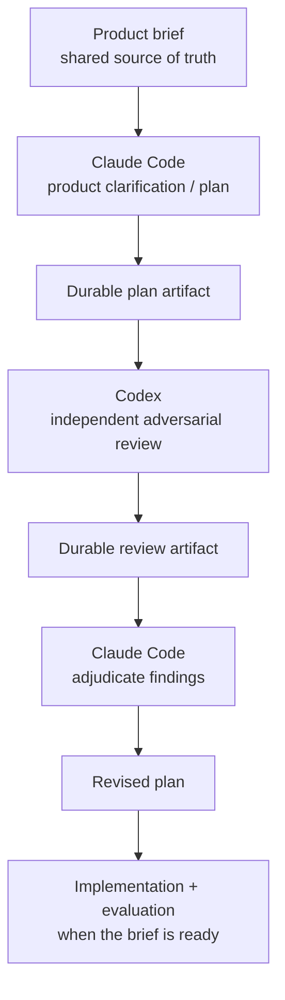

# Current Depth
*Working title.*

Current Depth is an early-stage personal project about two related problems:

1. building a better way to stay current with professional reading without recreating an inbox or backlog; and
2. learning how to work more deliberately with coding-agent harnesses such as Claude Code, Codex, and later Cursor.

The **product brief**, not this README, is the source of truth for product decisions.

---

## Why this repo also exists as an agent-workflow lab

I want to move beyond choosing whichever model is newest and instead build evidence about two different questions:

### Question A — Model

> Which model reasons best about a given kind of task?

### Question B — Harness

> Which working environment helps me accomplish that task best?

Those are not the same question.

A comparison such as Claude Code + one model versus Codex + another model is useful as an **operational benchmark** — it can tell me which setup I prefer for the work — but it does not isolate model quality.

The longer-term aim is to learn when to use particular models, harnesses, skills, review patterns, and orchestration strategies based on evidence rather than novelty.

---

## Current stage

**Pre-architecture. Nothing is implemented.**

The immediate work is still product clarification and evidence gathering. As of brief v1.3 the two questions that were blocking are closed — what is actually arriving, and what outcome would count as success — and the largest open question is how big one delivery should be. Section 10 of the brief carries the current order of work.

Some items in the product brief are:

- **Confirmed**
- **Proposed**
- **Assumptions**
- **Unresolved**

Those categories matter. Nothing in this README should upgrade a proposed decision or assumption into a requirement.

See [`docs/product-brief.md`](docs/product-brief.md) for the current product state.

---

## Initial cross-harness experiment

The first workflow under test is intentionally simple:



Cursor will be introduced later as a third challenger, after the first Claude Code ↔ Codex workflow is interpretable.

The point is not to maximize the number of agents. The point is to give different reasoning jobs **independent contexts** and leave an inspectable record of what happened.

---

## Ground-truth hierarchy

For project work, use this order:

1. `docs/product-brief.md` — product status, decisions, assumptions, unresolved questions
2. accepted artifacts in `docs/plans/`, `docs/reviews/`, and `docs/evals/`
3. `AGENTS.md` — shared agent operating rules
4. `CLAUDE.md` — Claude-specific adapter instructions
5. conversation history — useful context, but not authoritative project state

If two artifacts conflict, surface the conflict rather than silently reconciling it.

---

## Repository map

This is a **target / evolving structure**, not a claim that every path currently exists.

```text
current-depth/
├── README.md
├── AGENTS.md
├── CLAUDE.md
│
└── docs/
    ├── product-brief.md
    ├── plans/          # created/populated when a durable plan exists
    ├── reviews/        # created/populated when a durable review exists
    └── evals/          # evaluation definitions and results
```

Implementation directories should be added only when an accepted architecture justifies them.

> **Git note:** Git does not track empty directories. A directory may exist locally while being absent from `git status`, `git ls-files`, a remote push, or file-oriented search tools. Agents must verify filesystem state directly before claiming that a directory does or does not exist.

---

## Working principles

- **Keep product truth out of harness instructions.** `AGENTS.md` and `CLAUDE.md` should remain light.
- **Persist important reasoning.** Plans, reviews, decisions, and evals should survive a fresh agent session.
- **Do not harden assumptions accidentally.** Preserve the product brief's status labels.
- **Prefer independent review.** A reviewer should receive the artifact, not the implementer's full reasoning history.
- **Make evaluation explicit.** Correctness, interventions, time, cost, regressions, and human preference can all matter.
- **Prefer evidence over sophistication.** More agents, tools, abstractions, or newer models are not automatically better.

---

## What belongs here — and what does not

The README explains:

- why the project exists
- how the cross-harness experiment works
- where project truth lives
- the broad repository structure

It intentionally does **not** restate detailed product requirements.

That separation is deliberate: if a product decision changes, it should be changed once in the product brief rather than copied into multiple agent-facing files.

---

## Working title

**Current Depth** is provisional. Naming is not a blocker for the current work.
